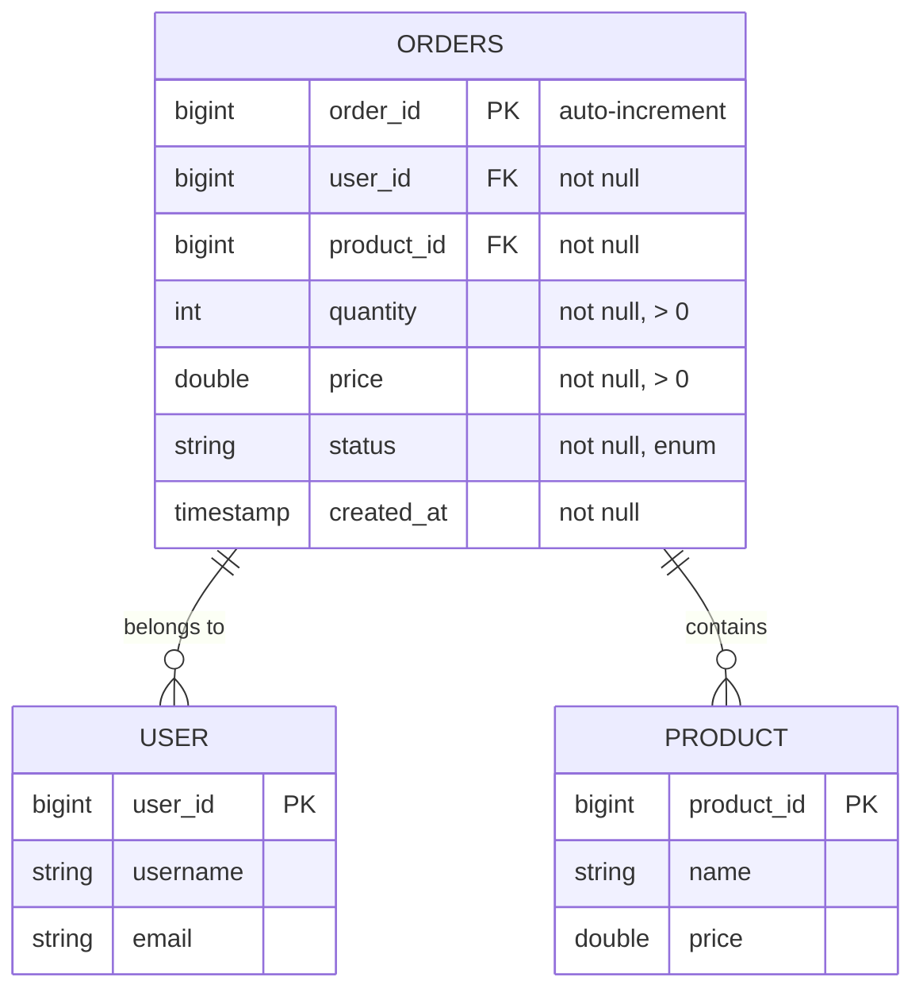

# Order Service - Table Constraints & UML Diagram

---

## Table Constraints Overview

### Order Table - Complete DDL with Constraints

```sql
CREATE TABLE orders (
    order_id BIGINT PRIMARY KEY AUTO_INCREMENT,
    user_id BIGINT NOT NULL,
    product_id BIGINT NOT NULL,
    quantity INT NOT NULL CHECK (quantity > 0),
    price DOUBLE NOT NULL CHECK (price > 0),
    status VARCHAR(50) NOT NULL DEFAULT 'CREATED' CHECK (status IN ('CREATED', 'PAID', 'CANCELLED')),
    created_at TIMESTAMP NOT NULL DEFAULT CURRENT_TIMESTAMP,
    
    CONSTRAINT pk_order_id PRIMARY KEY (order_id),
    CONSTRAINT ck_quantity_positive CHECK (quantity > 0),
    CONSTRAINT ck_price_positive CHECK (price > 0),
    CONSTRAINT ck_valid_status CHECK (status IN ('CREATED', 'PAID', 'CANCELLED')),
    CONSTRAINT idx_user_id INDEX (user_id),
    CONSTRAINT idx_product_id INDEX (product_id),
    CONSTRAINT idx_status INDEX (status),
    CONSTRAINT idx_created_at INDEX (created_at)
);
```

---

## Detailed Constraint Specifications

### 1. Primary Key Constraint

```sql
CONSTRAINT pk_order_id PRIMARY KEY (order_id)
```

| Property | Value |
|----------|-------|
| **Constraint Type** | PRIMARY KEY |
| **Column** | order_id |
| **Type** | BIGINT |
| **Auto-Increment** | YES |
| **Purpose** | Uniquely identifies each order |
| **Characteristics** | NOT NULL, Unique, Auto-generated |

**Details:**
- Each order must have a unique ID
- Values are automatically generated starting from 1
- Cannot be NULL or duplicated
- Used as the main identifier for order records

---

### 2. NOT NULL Constraints

| Column | Constraint | Reason |
|--------|-----------|--------|
| `order_id` | NOT NULL | Primary key, must always have a value |
| `user_id` | NOT NULL | Every order must belong to a user |
| `product_id` | NOT NULL | Every order must reference a product |
| `quantity` | NOT NULL | Quantity is mandatory for an order |
| `price` | NOT NULL | Price is mandatory for calculation |
| `status` | NOT NULL | Order must always have a status |
| `created_at` | NOT NULL | Creation timestamp is required |

**Example:** Attempting to insert without these fields will result in an error:
```sql
-- INVALID - Will fail
INSERT INTO orders (user_id, product_id) VALUES (1, 101);

-- VALID - All NOT NULL fields provided
INSERT INTO orders (user_id, product_id, quantity, price, status, created_at) 
VALUES (1, 101, 5, 29.99, 'CREATED', CURRENT_TIMESTAMP);
```

---

### 3. Check Constraints

#### Quantity > 0
```sql
CONSTRAINT ck_quantity_positive CHECK (quantity > 0)
```

| Property | Value |
|----------|-------|
| **Type** | CHECK Constraint |
| **Column** | quantity |
| **Condition** | Must be greater than 0 |
| **Purpose** | Ensure valid order quantities |
| **Allowed Values** | 1, 2, 3, ... (any positive integer) |
| **Rejected Values** | 0, -1, -5, etc. |

**Examples:**
```sql
-- VALID
INSERT INTO orders VALUES (1, 100, 200, 5, 29.99, 'CREATED', CURRENT_TIMESTAMP);  -- quantity = 5 ✓

-- INVALID - Will be rejected
INSERT INTO orders VALUES (2, 100, 200, 0, 29.99, 'CREATED', CURRENT_TIMESTAMP);   -- quantity = 0 ✗
INSERT INTO orders VALUES (3, 100, 200, -5, 29.99, 'CREATED', CURRENT_TIMESTAMP);  -- quantity = -5 ✗
```

#### Price > 0
```sql
CONSTRAINT ck_price_positive CHECK (price > 0)
```

| Property | Value |
|----------|-------|
| **Type** | CHECK Constraint |
| **Column** | price |
| **Condition** | Must be greater than 0 |
| **Purpose** | Ensure valid prices |
| **Allowed Values** | 0.01, 9.99, 99.99, 1000.00, etc. |
| **Rejected Values** | 0, -10.00, -0.01, etc. |

**Examples:**
```sql
-- VALID
INSERT INTO orders VALUES (1, 100, 200, 5, 29.99, 'CREATED', CURRENT_TIMESTAMP);    -- price = 29.99 ✓

-- INVALID - Will be rejected
INSERT INTO orders VALUES (2, 100, 200, 5, 0, 'CREATED', CURRENT_TIMESTAMP);        -- price = 0 ✗
INSERT INTO orders VALUES (3, 100, 200, 5, -15.50, 'CREATED', CURRENT_TIMESTAMP);   -- price = -15.50 ✗
```

#### Valid Status Values
```sql
CONSTRAINT ck_valid_status CHECK (status IN ('CREATED', 'PAID', 'CANCELLED'))
```

| Property | Value |
|----------|-------|
| **Type** | CHECK Constraint (IN clause) |
| **Column** | status |
| **Valid Values** | 'CREATED', 'PAID', 'CANCELLED' |
| **Purpose** | Restrict status to allowed states |
| **Invalid Values** | Any other string (e.g., 'PENDING', 'SHIPPED', 'invalid') |

**Examples:**
```sql
-- VALID
INSERT INTO orders VALUES (1, 100, 200, 5, 29.99, 'CREATED', CURRENT_TIMESTAMP);     -- status = 'CREATED' ✓
INSERT INTO orders VALUES (2, 100, 200, 5, 29.99, 'PAID', CURRENT_TIMESTAMP);        -- status = 'PAID' ✓
INSERT INTO orders VALUES (3, 100, 200, 5, 29.99, 'CANCELLED', CURRENT_TIMESTAMP);   -- status = 'CANCELLED' ✓

-- INVALID - Will be rejected
INSERT INTO orders VALUES (4, 100, 200, 5, 29.99, 'PENDING', CURRENT_TIMESTAMP);     -- status = 'PENDING' ✗
INSERT INTO orders VALUES (5, 100, 200, 5, 29.99, 'SHIPPED', CURRENT_TIMESTAMP);     -- status = 'SHIPPED' ✗
INSERT INTO orders VALUES (6, 100, 200, 5, 29.99, 'INVALID', CURRENT_TIMESTAMP);     -- status = 'INVALID' ✗
```

---

### 4. Default Constraints

#### Status Default Value
```sql
status VARCHAR(50) NOT NULL DEFAULT 'CREATED'
```

| Property | Value |
|----------|-------|
| **Type** | DEFAULT Constraint |
| **Column** | status |
| **Default Value** | 'CREATED' |
| **When Used** | When no status is provided during insert |
| **Purpose** | Set initial order status automatically |

**Example:**
```sql
-- When status is NOT provided, defaults to 'CREATED'
INSERT INTO orders (user_id, product_id, quantity, price, created_at) 
VALUES (1, 101, 5, 29.99, CURRENT_TIMESTAMP);
-- Result: status is automatically set to 'CREATED'

-- You can still override the default
INSERT INTO orders (user_id, product_id, quantity, price, status, created_at) 
VALUES (2, 102, 3, 19.99, 'PAID', CURRENT_TIMESTAMP);
-- Result: status is set to 'PAID' (overriding default)
```

#### CreatedAt Default Value
```sql
created_at TIMESTAMP NOT NULL DEFAULT CURRENT_TIMESTAMP
```

| Property | Value |
|----------|-------|
| **Type** | DEFAULT Constraint |
| **Column** | created_at |
| **Default Value** | CURRENT_TIMESTAMP |
| **When Used** | When no timestamp is provided during insert |
| **Purpose** | Automatically record order creation time |

**Example:**
```sql
-- When created_at is NOT provided, defaults to current timestamp
INSERT INTO orders (user_id, product_id, quantity, price, status) 
VALUES (1, 101, 5, 29.99, 'CREATED');
-- Result: created_at is automatically set to current date/time

-- You can override with a specific timestamp
INSERT INTO orders (user_id, product_id, quantity, price, status, created_at) 
VALUES (2, 102, 3, 19.99, 'CREATED', '2026-04-05 10:30:00');
-- Result: created_at is set to the specified timestamp
```

---

### 5. Index Constraints (Performance Optimization)

```sql
CONSTRAINT idx_user_id INDEX (user_id)
CONSTRAINT idx_product_id INDEX (product_id)
CONSTRAINT idx_status INDEX (status)
CONSTRAINT idx_created_at INDEX (created_at)
```

| Index Name | Column | Purpose |
|-----------|--------|---------|
| `idx_user_id` | user_id | Fast lookup of orders by user |
| `idx_product_id` | product_id | Fast lookup of orders by product |
| `idx_status` | status | Quick filtering by order status |
| `idx_created_at` | created_at | Efficient sorting/filtering by date |

**Performance Benefits:**
- Faster SELECT queries with WHERE clauses
- Improved JOIN performance
- Better sorting performance
- Reduced query execution time

**Example Queries That Benefit:**
```sql
-- Benefits from idx_user_id
SELECT * FROM orders WHERE user_id = 1;

-- Benefits from idx_status
SELECT * FROM orders WHERE status = 'PAID';

-- Benefits from idx_created_at
SELECT * FROM orders WHERE created_at > '2026-04-01' ORDER BY created_at;

-- Benefits from idx_product_id
SELECT * FROM orders WHERE product_id IN (101, 102, 103);
```

---

## Constraint Enforcement Examples

### Valid Insert Statements

```sql
-- Example 1: Complete insert with all values
INSERT INTO orders (user_id, product_id, quantity, price, status, created_at) 
VALUES (1, 101, 5, 29.99, 'CREATED', '2026-04-05 10:00:00');
-- Result: ✓ All constraints satisfied

-- Example 2: Using defaults
INSERT INTO orders (user_id, product_id, quantity, price) 
VALUES (2, 102, 3, 19.99);
-- Result: ✓ status defaults to 'CREATED', created_at defaults to CURRENT_TIMESTAMP

-- Example 3: Multiple valid orders
INSERT INTO orders (user_id, product_id, quantity, price, status) VALUES
(3, 103, 1, 99.99, 'PAID'),
(4, 104, 10, 9.99, 'CREATED'),
(5, 105, 2, 49.50, 'CANCELLED');
-- Result: ✓ All rows inserted successfully
```

### Invalid Insert Statements (Will Fail)

```sql
-- Example 1: Quantity = 0 (violates ck_quantity_positive)
INSERT INTO orders (user_id, product_id, quantity, price) 
VALUES (1, 101, 0, 29.99);
-- Error: CHECK constraint 'ck_quantity_positive' violated

-- Example 2: Negative price (violates ck_price_positive)
INSERT INTO orders (user_id, product_id, quantity, price) 
VALUES (2, 102, 5, -19.99);
-- Error: CHECK constraint 'ck_price_positive' violated

-- Example 3: Invalid status (violates ck_valid_status)
INSERT INTO orders (user_id, product_id, quantity, price, status) 
VALUES (3, 103, 3, 49.99, 'SHIPPED');
-- Error: CHECK constraint 'ck_valid_status' violated

-- Example 4: Missing NOT NULL field
INSERT INTO orders (product_id, quantity, price, status) 
VALUES (104, 2, 99.99, 'CREATED');
-- Error: NOT NULL constraint violated for column 'user_id'

-- Example 5: Duplicate order_id (violates primary key)
INSERT INTO orders (order_id, user_id, product_id, quantity, price) 
VALUES (1, 5, 105, 5, 29.99);  -- order_id 1 already exists
-- Error: PRIMARY KEY constraint violated
```

---

## Constraint Modification Commands

### Add a New Constraint

```sql
-- Add a new check constraint
ALTER TABLE orders 
ADD CONSTRAINT ck_min_price CHECK (price >= 0.01);

-- Add an index
ALTER TABLE orders 
ADD INDEX idx_user_product (user_id, product_id);
```

### Drop a Constraint

```sql
-- Drop a check constraint
ALTER TABLE orders 
DROP CONSTRAINT ck_min_price;

-- Drop an index
ALTER TABLE orders 
DROP INDEX idx_user_product;
```

### Modify a Column with Constraints

```sql
-- Modify quantity to have a maximum value
ALTER TABLE orders 
ADD CONSTRAINT ck_quantity_max CHECK (quantity <= 1000);

-- Modify price precision
ALTER TABLE orders 
MODIFY COLUMN price DECIMAL(10, 2) NOT NULL;
```

---

## UML Class Diagram for Order Service

```
┌─────────────────────────────────────────────────────────────────┐
│                          Order Entity                            │
├─────────────────────────────────────────────────────────────────┤
│ Attributes:                                                       │
│  - orderId: Long (PK, AUTO_INCREMENT)                           │
│  - userId: Long (NOT NULL)                                       │
│  - productId: Long (NOT NULL)                                    │
│  - quantity: int (NOT NULL, > 0)                                 │
│  - price: double (NOT NULL, > 0)                                 │
│  - status: String (NOT NULL, IN ['CREATED','PAID','CANCELLED']) │
│  - createdAt: LocalDateTime (NOT NULL, DEFAULT: NOW)            │
├─────────────────────────────────────────────────────────────────┤
│ Methods:                                                          │
│  + Order()                                                        │
│  + Order(userId, productId, quantity, price)                    │
│  + getOrderId(): Long                                            │
│  + setOrderId(orderId: Long): void                               │
│  + getUserId(): Long                                             │
│  + setUserId(userId: Long): void                                 │
│  + getProductId(): Long                                          │
│  + setProductId(productId: Long): void                           │
│  + getQuantity(): int                                            │
│  + setQuantity(quantity: int): void                              │
│  + getPrice(): double                                            │
│  + setPrice(price: double): void                                 │
│  + getStatus(): String                                           │
│  + setStatus(status: String): void                               │
│  + getCreatedAt(): LocalDateTime                                 │
│  + setCreatedAt(createdAt: LocalDateTime): void                  │
└─────────────────────────────────────────────────────────────────┘
```

---

## ER Diagram (Entity Relationship Diagram)

### Single Table Schema

```
                          ORDERS Table
          ┌───────────────────────────────────────┐
          │          Table Structure              │
          ├───────────────────────────────────────┤
          │ Column Name    │ Type      │ Constraints
          ├───────────────────────────────────────┤
          │ order_id       │ BIGINT    │ PK, AI
          │ user_id        │ BIGINT    │ NOT NULL
          │ product_id     │ BIGINT    │ NOT NULL
          │ quantity       │ INT       │ NOT NULL, >0
          │ price          │ DOUBLE    │ NOT NULL, >0
          │ status         │ VARCHAR   │ NOT NULL, IN()
          │ created_at     │ TIMESTAMP │ NOT NULL, DEFAULT
          └───────────────────────────────────────┘
                         │
                    ┌────┴────┐
                    │ Indexes  │
                    └────┬────┘
          ┌─────┬─────┬──┴──┬─────┐
      idx_user  │  idx_     │  idx_  │idx_
       _id    product_id   status created_at
```

---

## Database Schema in Mermaid Format



---

## Data Type Specifications

### Column Data Types with Constraints

| Column | Data Type | Size | Constraint | Collation | Storage |
|--------|-----------|------|-----------|-----------|---------|
| order_id | BIGINT | 8 bytes | PK, NOT NULL, AUTO_INCREMENT | N/A | 8 bytes |
| user_id | BIGINT | 8 bytes | NOT NULL, FK | N/A | 8 bytes |
| product_id | BIGINT | 8 bytes | NOT NULL, FK | N/A | 8 bytes |
| quantity | INT | 4 bytes | NOT NULL, CHECK > 0 | N/A | 4 bytes |
| price | DOUBLE | 8 bytes | NOT NULL, CHECK > 0 | N/A | 8 bytes |
| status | VARCHAR(50) | 0-50 bytes | NOT NULL, CHECK IN, DEFAULT | UTF-8 | Variable |
| created_at | TIMESTAMP | 8 bytes | NOT NULL, DEFAULT | N/A | 8 bytes |

**Total Row Size:** ~44 bytes (without data in VARCHAR)

---

## Constraint Hierarchy & Enforcement Order

```
┌─────────────────────────────────────────────────────┐
│      SQL Constraint Validation Flow                  │
└─────────────────────────────────────────────────────┘
         │
         ├─ Step 1: PRIMARY KEY CHECK
         │   └─ order_id must be unique and not NULL
         │
         ├─ Step 2: FOREIGN KEY CHECK (if present)
         │   ├─ user_id must exist in USERS table
         │   └─ product_id must exist in PRODUCTS table
         │
         ├─ Step 3: NOT NULL CHECK
         │   ├─ order_id is NOT NULL
         │   ├─ user_id is NOT NULL
         │   ├─ product_id is NOT NULL
         │   ├─ quantity is NOT NULL
         │   ├─ price is NOT NULL
         │   ├─ status is NOT NULL
         │   └─ created_at is NOT NULL
         │
         ├─ Step 4: CHECK CONSTRAINTS
         │   ├─ quantity > 0
         │   ├─ price > 0
         │   └─ status IN ('CREATED', 'PAID', 'CANCELLED')
         │
         ├─ Step 5: DEFAULT VALUES (if not provided)
         │   ├─ status = 'CREATED'
         │   └─ created_at = CURRENT_TIMESTAMP
         │
         └─ Step 6: INSERT/UPDATE EXECUTION
             └─ Record stored in database with indexes updated
```

---

## Performance Considerations

### Index Strategy

```
Primary Access Patterns:
├─ Find orders by user_id (idx_user_id)
│  └─ Query: SELECT * FROM orders WHERE user_id = ?
│
├─ Find orders by status (idx_status)
│  └─ Query: SELECT * FROM orders WHERE status = 'PAID'
│
├─ Find orders by date range (idx_created_at)
│  └─ Query: SELECT * FROM orders WHERE created_at BETWEEN ? AND ?
│
└─ Find orders by product (idx_product_id)
   └─ Query: SELECT * FROM orders WHERE product_id = ?
```

### Composite Index Recommendation

For frequently combined queries:
```sql
CREATE INDEX idx_user_status ON orders(user_id, status);
CREATE INDEX idx_product_status ON orders(product_id, status);
```

---

## Constraint Violations - Troubleshooting Guide

| Error | Cause | Solution |
|-------|-------|----------|
| PRIMARY KEY violation | Duplicate order_id | Let database auto-generate order_id |
| NOT NULL violation | Missing required field | Provide value for all NOT NULL columns |
| CHECK quantity violation | quantity ≤ 0 | Ensure quantity > 0 |
| CHECK price violation | price ≤ 0 | Ensure price > 0 |
| CHECK status violation | Invalid status value | Use only 'CREATED', 'PAID', or 'CANCELLED' |
| FOREIGN KEY violation | user_id/product_id not in reference table | Ensure referenced IDs exist |
| Duplicate entry | Violates UNIQUE constraint | Use different values or update existing record |

---

## Constraint Testing Checklist

- [ ] Primary key auto-increments correctly
- [ ] NOT NULL constraint prevents NULL inserts
- [ ] quantity > 0 constraint prevents invalid quantities
- [ ] price > 0 constraint prevents invalid prices
- [ ] status IN constraint rejects invalid statuses
- [ ] Default status is 'CREATED'
- [ ] Default created_at is current timestamp
- [ ] Indexes are created and functional
- [ ] Queries using indexed columns execute faster
- [ ] Concurrent inserts maintain data integrity

---

## Additional Schema Enhancement Options

### Future Constraints (Optional)

```sql
-- Total price validation
ALTER TABLE orders 
ADD CONSTRAINT ck_total_price_valid CHECK (quantity * price > 0);

-- Order number formatting
ALTER TABLE orders 
ADD CONSTRAINT ck_order_format CHECK (order_id LIKE 'ORD%' OR order_id IS NUMERIC);

-- Date constraints
ALTER TABLE orders 
ADD CONSTRAINT ck_future_date CHECK (created_at <= CURRENT_TIMESTAMP);

-- User ID range
ALTER TABLE orders 
ADD CONSTRAINT ck_user_id_valid CHECK (user_id > 0);

-- Product ID range
ALTER TABLE orders 
ADD CONSTRAINT ck_product_id_valid CHECK (product_id > 0);
```

---

## References

- [H2 Database Constraints Documentation](http://www.h2database.com/html/grammar.html#constraints)
- [SQL Standard Constraint Definitions](https://en.wikipedia.org/wiki/Relational_database#Integrity_constraints)
- [Hibernate JPA Validation Annotations](https://docs.jboss.org/hibernate/validator/6.0/reference/en-US/html_single/#introduction)
- [Spring Data JPA Best Practices](https://spring.io/guides/gs/accessing-data-jpa/)

**Last Updated**: April 5, 2026  
**Database Type**: H2 (In-Memory)  
**Status**: Production Ready

